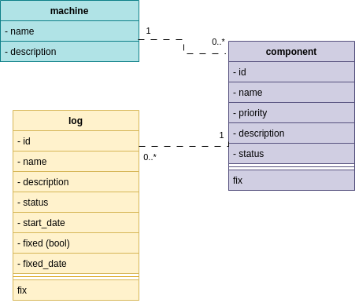

# Project Tech Planning

## Project Description

This project is a cli application to monitor the components in a machine that needs maintenance. The user can report errors and then fix them at a later time. And you can use the dashboard to see the status of the components.

## Tech Stack

- Rust
- SQLite
- clap

## Features

- manage components
- report errors
- fix errors
- dashboard

## class diagram



## CLI Commands


## testing strategy

- unit tests
- integration tests
- test coverage with tarpaulin

## File Structure

```shell
.
├── Cargo.lock
├── Cargo.toml
└── src
    ├── main.rs
    ├── common.rs
    ├── ops
    │   ├── add.rs
    │   ├── delete.rs
    │   ├── fix.rs
    │   ├── report.rs
    │   └── update.rs
    └── sql
        └── setup.sql
```

## Notes

- the status of a component can be from 1 to 5 :
  - 1: Optimal
  - 2: improvable
  - 3: unadjusted
  - 4: suboptimal
  - 5: defective
- the priority of a component can be from 1 to 4 :
  - 1: critical
  - 2: high
  - 3: medium
  - 4: low
